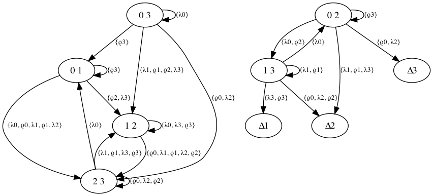
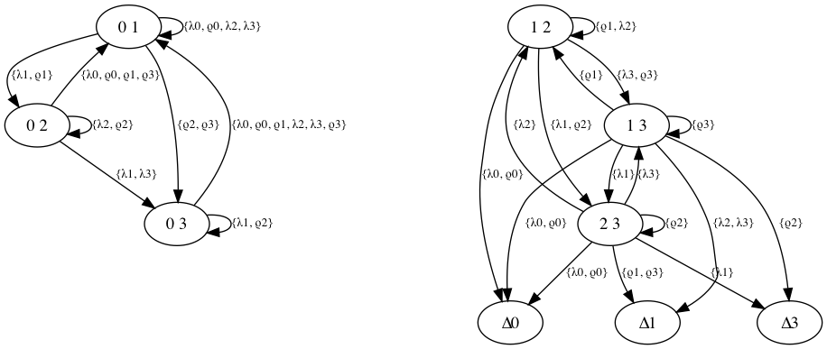
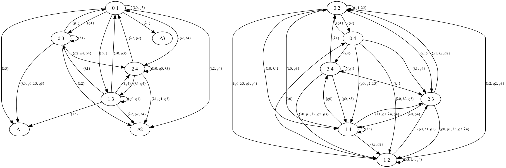

# Groupoid assistant
This code is used to assist in generating examples for various conjectures in universal algebra and computer science. In particular, we are interested in resolving some of the conjectures listed in this document https://www.wirtschaft.bfh.ch/fileadmin/wgs_upload/wirtschaft_und_verwaltung/6_forschung/E-Government/AAA93/AAA93_Clark_2.pdf.

Here are some examples of separating-relation graphs that have been produced by this application:

